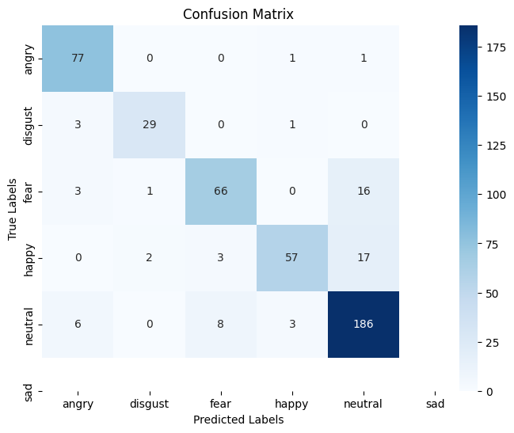
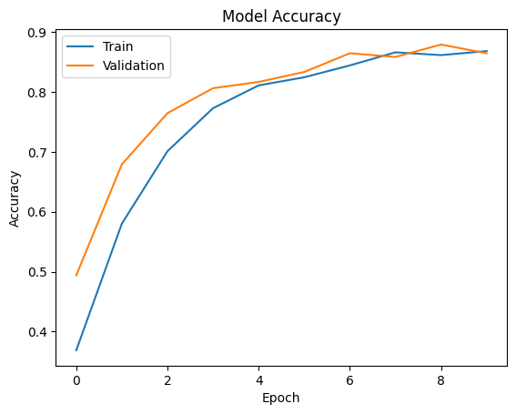
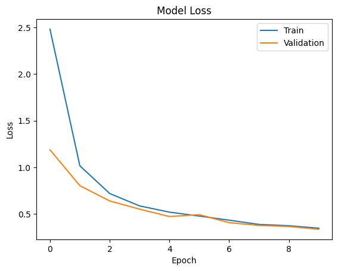

# 🎙️ Emotion Detection Through Speech Signal Using CNN

A Machine Learning project that detects human emotions from speech audio using a Convolutional Neural Network (CNN), trained and tested on the **TESS (Toronto Emotional Speech Set)** dataset.

---

## 📌 Overview

This project takes a speech signal as input, converts it into numerical features (MFCCs), and feeds them into a CNN model to classify the emotion being expressed. The model is trained and tested on the **TESS (Toronto Emotional Speech Set)** dataset.

---

## 🎯 Emotions Detected
- 😡 Angry
- 🤢 Disgust
- 😨 Fear
- 😄 Happy
- 😐 Neutral
- 😢 Sad

---

## 🛠️ Tech Stack

| Tool | Purpose |
|------|---------|
| Python 3.11 | Core language |
| TensorFlow / Keras | CNN model |
| Librosa | Audio feature extraction |
| Scikit-learn | Preprocessing & evaluation |
| NumPy / Pandas | Data handling |
| Matplotlib / Seaborn | Visualisation |

---

## 📂 Project Structure

```
emotion-detection-speech/
├── training.ipynb   ← Main code
├── README.md                     ← You are here
├── tensorflow librosa scikit-learn matplotlib seaborn ipython  :Dependencies
└── confusion_matrix.png          ← Results
```

---

## 🚀 How to Run

### 1. Clone the repository
```bash
git clone https://github.com/YourUsername/emotion-detection-speech.git
cd emotion-detection-speech
```

### 2. Install dependencies
```bash
pip install tensorflow librosa scikit-learn matplotlib seaborn ipython
```

### 3. Download the TESS dataset
Download from Kaggle: https://www.kaggle.com/datasets/ejlok1/toronto-emotional-speech-set-tess

Extract and update the path in the code:
```python
data_dir = r"path/to/TESS Toronto emotional speech set data"
```

### 4. Run the code
training.ipynb

---

## 📊 Results

| Metric | Value |
|--------|-------|
| **Test Accuracy** | 86% |
| **Train Accuracy** | 89% |
| **Model** | CNN |
| **Epochs** | 10 |
| **Batch Size** | 64 |

### Confusion Matrix


### Model Accuracy


### Model Loss


### Per-Class Performance
| Emotion | Accuracy |
|---------|----------|
| Angry | 97% ✅ |
| Disgust | 88% ✅ |
| Neutral | 92% ✅ |
| Fear | 77% |
| Happy | 72% |

### Key Observations
- **Angry** and **Neutral** are detected with the highest accuracy (97% and 92%)
- **Fear** is occasionally misclassified as Neutral due to acoustic similarity in low-energy speech
- **Happy** is sometimes confused with Neutral as pleasant-calm tones overlap

---

## 🧠 How It Works

```
Speech Signal (.wav)
        ↓
   Load with Librosa
        ↓
  Extract MFCC Features (13 coefficients)
        ↓
   Data Augmentation (noise, time stretch, pitch shift)
        ↓
    CNN Model (Conv2D → Flatten → Dense → Softmax)
        ↓
   Emotion Classification (6 classes)
```

---

## 🌍 Real-World Applications
- 📞 Customer service & call centers
- 🏥 Healthcare & mental health monitoring
- 🎓 Education & e-learning platforms
- 🤝 Human-computer interaction
- 🧘 Therapy & emotional support systems

---

## 📦 Dataset
**TESS — Toronto Emotional Speech Set**
- 2 actresses (aged 26 and 64)
- 200 target words per emotion
- 7 emotions, 2800 audio stimuli total
- Authors: Kate Dupuis, M. Kathleen Pichora-Fuller
- University of Toronto, 2010
- License: CC BY-NC-ND 4.0